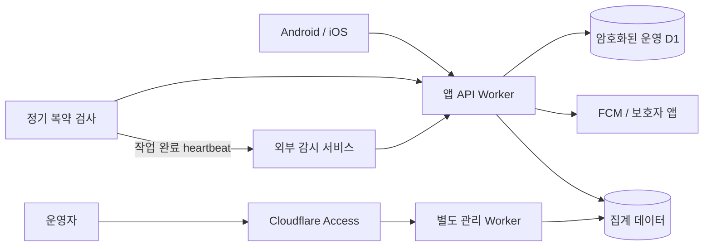

# PillNote 운영·복약 모니터링 기획

작성: 2026-10-07 (JST). 이 문서는 최초 기획이다. 이후 운영자 대시보드와 익명 집계를
`/Users/kimrasng/dev/pillnoteadmin`에 구현했다. 현재 구현·배포 절차는
[관리 웹 README](../../pillnoteadmin/README.md)에 있다. 원격 관리 웹 배포, 외부 모니터,
운영자 장애 통지와 보호자 개인 복약 조회는 아직 설정·구현하지 않았다.
앱 종료 중 복용 기록 확인 기능은 별도 구현했으며 배포 안내는 [서버 미복용 검사](SERVER_MISSED_DOSE_2026-10-07.md)에 있다.

## 목표와 사용자

1. 운영자는 API, DB, 이메일·푸시, 정기 검사의 장애를 인지하고 원인을 찾는다.
2. 환자와 수락한 보호자는 복용 예정·기록·미확인 상태와 마지막 동기화를 이해한다.
3. 운영자 화면을 통해 사용자별 약 이름과 복용 이력을 일괄 열람할 수 있게 만들지 않는다.

## 배치와 권한

같은 Cloudflare 계정에서 운영할 수 있다. 보안 경계는 Worker 이름·도메인 분리와 함께
인증, 내부 호출 범위, DB 바인딩·비밀키 제한으로 만든다.

| 구성 | 역할 | 허용 권한 | 공개 범위 |
| --- | --- | --- | --- |
| 기존 앱 API Worker | 로그인·동기화·보호자 연결 | 운영 D1, 기존 인증·암호화·발송 키 | 사용자 API |
| 복약 검사 | 동기화된 일정의 기록 확인·알림 | 기존 백엔드 내부 기능, 향후 전용 호출로 분리 | Cron, 공개 실행 API 없음 |
| 별도 관리 Worker | 운영 상태·집계·장애 조회 | 집계 저장소 또는 제한된 내부 조회 함수 | Cloudflare Access 뒤의 운영자 화면 |
| 외부 감시 서비스 | Cloudflare 밖에서 API 생존·작업 완료 확인 | 공개 /ready 조회, 서버의 완료 heartbeat | 운영자에게만 장애 통지 |
| 앱 오류 수집 | Android/iOS 크래시·버전별 오류 | 필터링된 기술 오류 | Firebase Crashlytics 콘솔 |

현재 복약 검사 Cron은 기존 Worker 내부에 둔다. 공개 관리 엔드포인트를 추가하지 않으므로
이를 위해 새 DB나 관리자 키를 앱에 넣을 필요가 없다. 규모가 커지면 Cron 호출 Worker를
분리하고 Service Binding으로 제한된 검사 함수만 호출한다. 관리 Worker에는 운영 D1,
JWT_SECRET, 데이터 복호화 키, FCM·Resend 키를 주지 않는다. 같은 DB와 키를 전부 공유하는
Worker 분리는 피해 범위를 충분히 줄이지 못한다.

## 1차 운영 화면

| 표시할 항목 | 목적 | 데이터 |
| --- | --- | --- |
| 현재 배포 버전·/ready | 배포 불일치·DB 준비 상태 발견 | 버전, storage/configured 상태 |
| API 요청 수·HTTP 5xx 비율·응답 시간 | 사용자 API 장애·지연 발견 | 정규화한 경로, 상태 코드, p95 |
| 이메일 발송 성공·실패 | 로그인 장애 발견 | 시간별 건수, 제공자 오류 코드 |
| FCM 수락·실패·재시도 소진 | 보호자 알림 장애 발견 | 건수와 오류 분류 |
| 복약 검사 마지막 완료·처리 지연 | Cron 중단·작업 적체 발견 | 완료 시각, 처리 건수, 가장 오래된 대기 시각 |
| 앱 버전별 크래시 | 특정 Android/iOS 릴리스 문제 발견 | 버전·플랫폼·기술 스택 |

Workers invocation 오류와 HTTP 5xx는 별도로 집계한다. 코드가 처리한 HTTP 500은 invocation
성공으로 집계될 수 있기 때문이다. `/ready`는 DB 스키마와 외부 서비스 설정 유무를
확인하며 실제 메일·FCM 전송 성공을 검증하지 않는다. 실제 발송은 전송 결과와 별도의
테스트 계정으로 확인하고 일반 사용자에게 감시용 알림을 발송하지 않는다.

외부 uptime 감시는 Better Stack 같은 Cloudflare 외부 서비스가 /ready를 확인하도록 한다.
Cron은 작업이 완료된 후에만 완료 heartbeat를 보낸다. 처리 대상이 0건이어도 조회가 정상
완료되면 heartbeat를 보낸다. 시작 시점 heartbeat만 보내면 중간 실패를 놓칠 수 있다.

## 알림 기준 초안

아래 수치는 구현 시 초기 운영 규모에 맞춰 조정한다. 아직 활성화된 알림 규칙이 아니다.

| 신호 | 초기 기준 | 운영자 행동 |
| --- | --- | --- |
| API 준비 상태 실패 | 1분 검사, 3회 연속 실패 | 배포·D1·제공자 설정 확인 |
| Cron 완료 신호 누락 | 1분 주기 + 3분 유예 | Trigger·실행 로그·처리 실패 확인 |
| HTTP 5xx 증가 | 5분 동안 10건 이상이면서 5% 초과 | 오류 경로·버전 비교 |
| 이메일·푸시 지속 실패 | 5분 동안 3건 이상 | 제공자 장애·쿼터·키 확인 |
| 알림 재시도 소진 | 1건 발생 | 원인 확인 후 권한 있는 재처리 절차 검토 |
| 복약 검사 적체 | 가장 오래된 검사 대기 5분 초과 | 배치 크기·처리 시간·플랜 용량 검토 |

동일 장애는 하나로 묶고 복구 시 종료한다. 수신 채널·운영자 계정은 실제 구현 시 결정한다.
초기에는 외부 uptime·heartbeat와 기존 Cloudflare/Firebase 콘솔을 먼저 사용하고 자체
대시보드는 그 뒤에 만든다.

## 1차 복약 화면

환자와 수락한 보호자에게 필요한 정보는 예정 시각, 서버에 확인된 복용 기록, 확인 대기,
마지막 동기화, 알림 활성 여부다. 보호자 조회 API는 로그인한 보호자와 현재 accepted·enabled
관계를 매번 검증한다. 연결 해제 후 조회도 차단한다. 운영자 전용 화면과 인증을 공유하지 않는다.
현재 보호자 초대·푸시는 구현되어 있으나 보호자용 복약 기록 조회 화면/API는 후속 기획 범위다.

- “미복용 확정” 대신 “복용 기록 미확인”으로 표시한다.
- 오프라인 기록과 오래된 동기화는 별도 상태로 표시한다.
- FCM 요청 수락, 실제 기기 수신, 사용자의 알림 열람을 서로 구분한다. 현재의 sent 상태는
  FCM 수락을 의미하며 기기 도착·열람을 증명하지 않는다.
- 사용자가 켜 둔 보호자 알림, 보호자의 초대 수락, 현재 연결 상태가 기준이다.
- 약 이름·복약 일정은 사용자/보호자 화면의 목적에 필요한 경우에만 조회한다.

## 검사 규모 확장

현재 정기 검사는 한 실행당 계정 25개·계정당 알림 5개·전체 성공 전송 20건으로 작업량을
제한한다. 처리가 끝난 사용자는 다음 예정 시각까지 대기하지만, 같은 시각에 많은 건이
몰리면 대기시간이 늘어날 수 있다. 출시 규모에 맞춘 동시 예정 건 부하 테스트가 필요하다.
운영 화면에는 가장 오래된 검사 대기 시각을 표시하고, 규모가 커지면 due job과 발송을
Cloudflare Queues 소비자로 분리해 처리량을 늘린다. Worker/D1 플랜 제한과 FCM 발송
쿼터를 함께 확인하며 검사 실패를 숨기는 방식으로 배치 크기만 늘리지 않는다.

## 접근 보호와 데이터 최소화

관리 도메인은 예를 들어 ops 서브도메인으로 분리하고 Cloudflare Access에서 운영자 계정을
제한한다. MFA를 적용하고 Worker에서도 Access JWT의 서명·issuer·audience·만료를 검증한다.
workers.dev·preview·다른 도메인으로 인증을 우회하는 경로도 닫는다. UI를 숨기는 것만으로
보호했다고 보지 않는다.

로그에는 JWT, refresh token, FCM token, 이메일 인증번호, 요청 본문, 암호화 백업, 약 이름,
개인 복약 이력과 원문 이메일을 남기지 않는다. 기술 오류·요청 ID·정규화한 경로·상태 코드와
집계 숫자를 사용한다. 외부 heartbeat에는 완료 여부와 집계만 보내며 URL 토큰은 secret으로
보관한다. Crashlytics에 사용자 데이터가 담긴 예외·로그가 유입되지 않도록 필터링한다.

집계 데이터와 관리 접근 기록은 최초 보관 정책을 30일로 제안하며 운영 필요에 맞춰 확정한다.
운영자가 재전송·사용자 정보 변경을 할 수 있는 버튼은 1차 범위에서 제외한다. 추후 필요하면
별도 역할, 재인증, 감사 기록, 대상 확인을 갖춘 후 설계한다.

## 구현 순서와 확인 기준

1. 외부 /ready 감시와 Cron 완료 heartbeat: API가 내려가거나 Cron이 중단되면 실제 운영자에게
   통지가 오는지 테스트 계정·테스트 환경에서 확인한다.
2. 앱 Crashlytics: Android/iOS 테스트 크래시가 올바른 빌드와 심볼로 표시되는지 확인한다.
3. 기술 집계 수집: HTTP 5xx, FCM 수락·실패, 미처리 대기를 정확히 구분하는지 확인한다.
4. Access로 보호한 읽기 전용 운영 화면: 비로그인·일반 앱 계정·다른 audience 토큰 접근과
   우회 도메인을 차단하고 운영 DB/비밀키가 관리 Worker에 없는지 확인한다.
5. 보호자 복약 조회: 초대 미수락·관계 해제·다른 환자 접근 차단과 오프라인 상태를 확인한다.

## 공식 근거

- [Cloudflare Cron Triggers](https://developers.cloudflare.com/workers/configuration/cron-triggers/): 1분 주기, UTC, 설정 전파 지연.
- [Service bindings](https://developers.cloudflare.com/workers/runtime-apis/bindings/service-bindings/): 공개 URL 없이 Worker 내부 통신.
- [Cloudflare Access JWT 검증](https://developers.cloudflare.com/cloudflare-one/access-controls/applications/http-apps/authorization-cookie/validating-json/): Worker에서도 Access 토큰 검증.
- [Workers metrics](https://developers.cloudflare.com/workers/observability/metrics-and-analytics/): invocation 상태와 HTTP 상태 차이.
- [Better Stack heartbeat](https://betterstack.com/docs/uptime/cron-and-heartbeat-monitor/): 완료 신호 누락과 유예 기간을 통한 작업 중단 감시.
- [Flutter Crashlytics](https://firebase.google.com/docs/crashlytics/flutter/get-started): Android/iOS 오류 수집 및 테스트 보고 확인.
